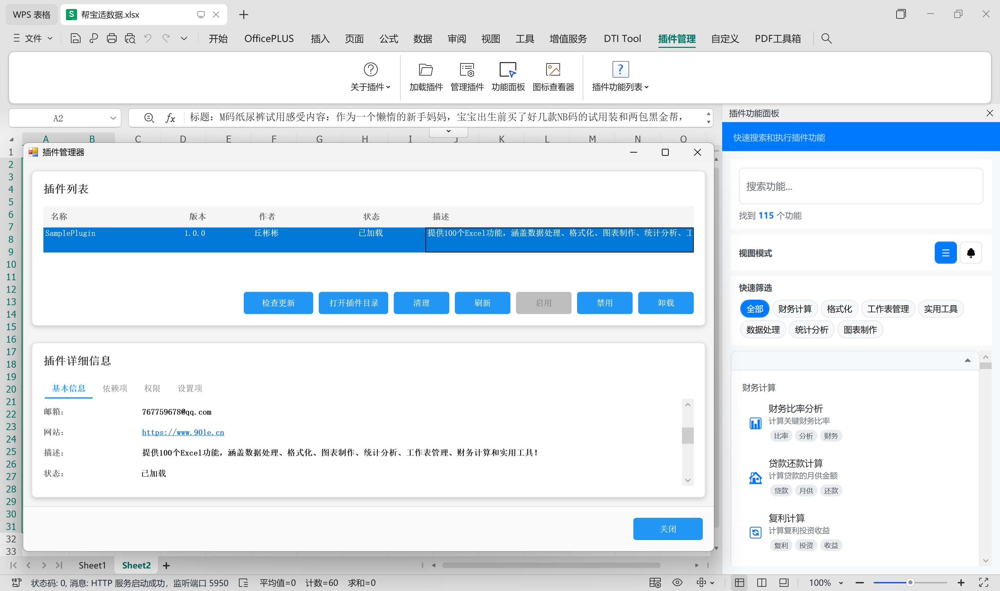
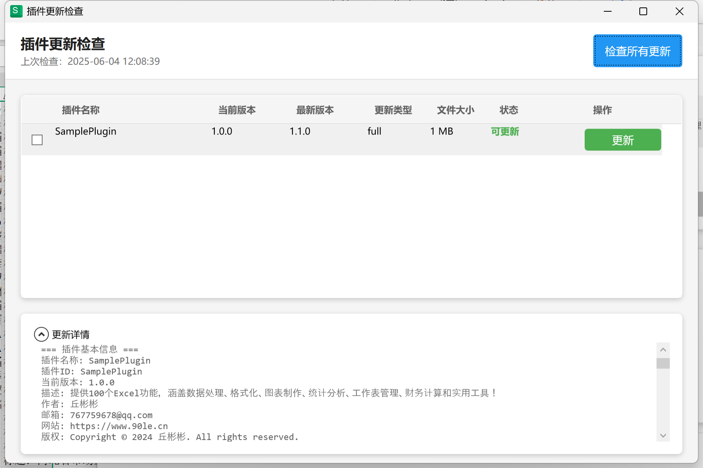
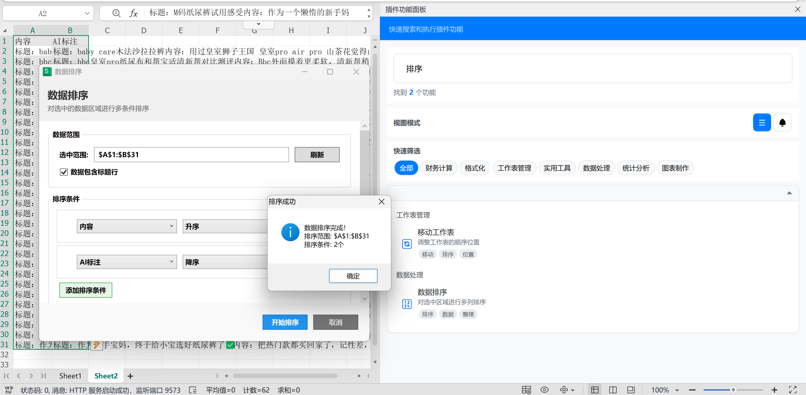

# 🚀 BasePlugin - Excel 插件开发基础模板

<div align="center">

[](https://github.com/90le/Excel-Plugin-Template/actions)
[](https://opensource.org/licenses/MIT)
[](https://dotnet.microsoft.com/download/dotnet-framework)
[](https://www.microsoft.com/office)

**一个功能完整的 Excel 插件开发模板，基于 DTI_Tool.AddIn 框架**

[📖 使用文档](#-快速开始) • [🎯 功能特性](#-功能特性) • [💡 示例展示](#-示例展示) • [🤝 贡献指南](docs/CONTRIBUTING.md)

</div>

## 📖 关于项目

BasePlugin 是一个专为 Excel 插件开发而设计的基础模板，提供完整的开发框架和最佳实践示例。无论您是插件开发新手还是经验丰富的开发者，都能从这个模板中快速开始您的项目。

> 宿主框架，近期每周更新，更多AI功能与Excel正在增加中！！！

### 🔌 关于 DTI_Tool.AddIn 框架

DTI_Tool.AddIn 是一个强大的热拔插插件开发框架，具有以下特性：

- 🔄 **热拔插支持** - 无需重启应用程序即可加载/卸载插件
- 🎯 **双平台兼容** - 同时支持 Microsoft Excel 和 WPS Office  
- 📦 **简单部署** - 将编译后的插件文件放置到指定目录即可自动加载
- 🛡️ **安全稳定** - 插件运行在独立的应用程序域中，确保宿主应用的稳定性

> 把你开发的插件，添加到 DTI_Tool.AddIn 插件目录下，即可加载和自定义插件功能。

## 🎯 功能特性

### 🏗️ 完整框架
- ✅ **IPlugin 接口实现** - 完整的插件生命周期管理
- ✅ **模块化架构** - 清晰的功能模块组织
- ✅ **错误处理机制** - 完善的异常处理和用户提示
- ✅ **COM 对象管理** - 安全的 Excel COM 对象操作

### 🎨 界面支持  
- ✅ **WinForms** - 适用于简单对话框和工具窗口
- ✅ **WPF + MVVM** - 现代化界面和数据绑定支持
- ✅ **Office 图标** - 内置 Office 风格图标支持

### 🔄 自动更新
- ✅ **版本检查** - 自动检查和提示更新
- ✅ **文件完整性** - SHA-256 文件验证
- ✅ **增量更新** - 支持全量和增量更新模式
- ✅ **服务器端示例** - 完整的更新服务器实现指南

### 📚 丰富文档
- ✅ **中文文档** - 详细的开发指南和API文档
- ✅ **示例代码** - 3个完整的功能示例
- ✅ **最佳实践** - 性能优化和错误处理指南
- ✅ **部署指南** - 从开发到发布的完整流程

## 📖 文档导航

- 📋 [项目总览](docs/项目总览.md) - 项目架构和功能概述
- 🛠️ [开发指南](docs/开发指南.md) - 详细的开发教程和最佳实践
- 🔄 [插件更新配置指南](docs/插件更新配置指南.md) - 自动更新功能配置说明
- 📚 [完整中文文档](docs/README-CN.md) - 详细的中文开发文档

## 🚀 快速开始

### 1️⃣ 克隆模板
```bash
git clone https://github.com/90le/Excel-Plugin-Template.git
cd Excel-Plugin-Template
```

### 2️⃣ 重命名和配置
```bash
# 重命名项目文件
mv BasePlugin.csproj MyExcelPlugin.csproj
mv BasePlugin.cs MyExcelPlugin.cs

# 修改命名空间（在代码中将 BasePlugin 替换为 MyExcelPlugin）
```


### 3️⃣ 自定义插件信息
```csharp
// 在 MyExcelPlugin.cs 中修改
public string Name => "我的Excel插件";
public string Description => "我的插件描述";
public string Author => "您的姓名";
```

### 4️⃣ 添加功能
```csharp
// 在 Features/SampleFeatures.cs 中添加新功能
new PluginFeature
{
    Id = "my_feature",
    Name = "我的功能",
    Description = "功能描述",
    Category = "我的分类",
    ImageMso = "FileNew",
    Action = MyFeatureMethod
}
```

### 5️⃣ 测试运行
把你编写的插件，放置宿主的 `Plugins` 文件夹中，即可从功能面板运行功能。
调试说明：请自行编写log日志，来进行错误处理和日志输出管理。

## 💡 示例展示

### 📸 功能截图

#### 📋 插件管理界面

*插件管理界面展示了已安装的插件列表，支持启用/禁用、更新检查、打开插件目录等管理功能*

#### 🔄 自动更新检查
  
*自动更新检查功能可以检测插件的最新版本，并显示详细的更新信息和版本对比*

#### 🛠️ Excel插件功能面板

*在Excel中使用插件功能，右侧面板展示了丰富的插件功能分类，左侧演示了数据排序等实用功能*

### 🔧 内置示例功能

| 功能 | 描述 | 技术点 |
|------|------|--------|
| 🌍 Hello World | 显示问候消息 | 基础消息框 |
| 📊 获取选择信息 | 显示当前选中区域信息 | Excel Range 操作 |
| ⏰ 插入当前时间 | 在活动单元格插入时间戳 | 单元格写入操作 |

### 🏗️ 项目结构
```
BasePlugin/
├── Core/                    # 核心功能模块
│   ├── FeatureManager.cs   # 功能管理器
│   ├── TaskPaneManager.cs  # 任务窗格管理器
│   ├── PluginLogger.cs     # 日志记录器
│   └── MessageHelper.cs    # 消息帮助类
├── Features/               # 功能实现模块
│   ├── BasicFeatures.cs    # 基础功能
│   ├── DataProcessingFeatures.cs  # 数据处理功能
│   ├── FormattingFeatures.cs      # 格式化功能
│   ├── WorksheetFeatures.cs       # 工作表管理功能
│   ├── UtilityFeatures.cs         # 实用工具功能
│   ├── WindowDemoFeatures.cs      # 窗口演示功能
│   └── LoggingDemoFeatures.cs     # 日志演示功能
├── Models/                 # 数据模型
│   └── PluginFeature.cs   # 功能模型
├── WPF/                   # WPF界面相关
│   ├── Views/            # 视图文件
│   ├── ViewModels/       # 视图模型
│   ├── Controls/         # 自定义控件
│   └── Common/           # 通用组件
└── BasePlugin.cs         # 插件主类
```

## 🛠️ 开发环境

### 系统要求
- Windows 10/11
- Visual Studio 2019/2022
- .NET Framework 4.8.1
- Microsoft Excel 2016+ 或 WPS Office

### 依赖项
- .NET Framework 4.8.1
- DTI_Tool.AddIn 框架

## 📋 路线图

### v1.0.0 ✅
- [x] 基础插件框架
- [x] 示例功能实现
- [x] WPF/WinForms 支持
- [x] 自动更新配置
- [x] 完整中文文档

### v1.1.0 🔄
- [ ] 更多示例功能
- [ ] 高级界面组件
- [ ] 单元测试框架
- [ ] 性能监控工具

### v1.2.0 📋
- [ ] 多语言支持
- [ ] 数字签名验证
- [ ] 配置管理增强

## 🤝 贡献

我们欢迎任何形式的贡献！

### 参与方式
- 🐛 [报告 Bug](https://github.com/90le/Excel-Plugin-Template/issues/new?template=bug_report.md)
- 💡 [提出功能建议](https://github.com/90le/Excel-Plugin-Template/issues/new?template=feature_request.md)
- 📖 改进文档
- 🔧 提交代码

### 开发者
感谢所有贡献者的努力！

[](https://github.com/90le/Excel-Plugin-Template/graphs/contributors)

## 📞 支持与联系

### 🆘 获取帮助
- 📖 [查看文档](docs/README-CN.md)
- 🐛 [提交 Issue](https://github.com/90le/Excel-Plugin-Template/issues)
- 💬 [讨论区](https://github.com/90le/Excel-Plugin-Template/discussions)

### 📱 联系方式
- 📧 邮箱：767759678@qq.com  
- 💬 微信：binStudy
- 🌐 博客：[www.90le.cn](https://www.90le.cn)

## 📜 许可证

本项目采用 [MIT 许可证](LICENSE)。

```
MIT License

Copyright (c) 2024 BasePlugin Contributors

Permission is hereby granted, free of charge, to any person obtaining a copy
of this software and associated documentation files (the "Software"), to deal
in the Software without restriction...
```

## ⭐ 支持项目

如果这个项目对您有帮助，请给我们一个 ⭐️ ！

---

<div align="center">

**让 Excel 插件开发变得简单！** 🚀

[立即开始](https://github.com/90le/Excel-Plugin-Template/archive/refs/heads/main.zip) • [查看文档](docs/README-CN.md) • [加入讨论](https://github.com/90le/Excel-Plugin-Template/discussions)

</div>
